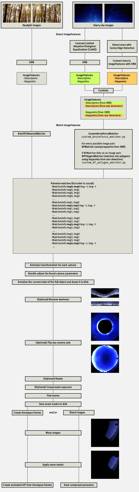
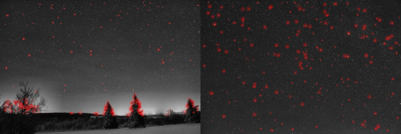
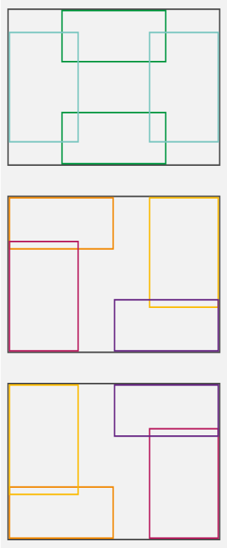
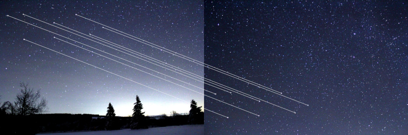
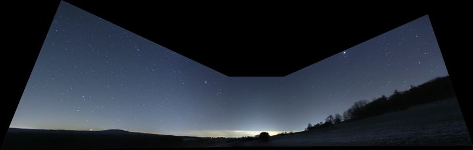

# OpenCV Starry Sky Panorama Stitcher

## Motivation

- PTGui (https://ptgui.com/) does an excellent stitching job but it does not recognize stars as features. On each combination of 2 starry sky image, at least 3 features on each have to be labeled **manually**. Taking 21 images of the night sky yields at least 36 overlaps between images. For each overlap at least 3 stars have to be labeled manually on both images of the overlap. Pretty annoying.
  
- https://github.com/opencv/opencv/blob/4.x/samples/python/stitching_detailed.py is a great example but not very self-explanatory for someone who hasn't stitched panoramas with OpenCV before. The stitching pipeline presented in `stitching_detaily.py` (comprising feature detection, pairwise image matching, homography estimation, bundle adjustment, waviness correction, image warping, stitching seam estimation and seaming/masking, timelapsing of warped images, blending of warped images) does not provide deep insights into what OpenCV is doing under the hood and what is the result/output of each step. 
  **Remedy is provided here:** The stitching pipeline presented here is an enhanced version of `stitching_detaily.py` and offers more documentation within the code and a better understanding of each step within the stitching pipeline due to a lot of image output to disk.
- The matchers used in  `stitching_detaily.py`  (`cv.detail_BestOf2NearestMatcher` and `cv.detail_BestOf2NearestRangeMatcher`) perform poorly on starry sky images. **Therefore a custom bruteforce matcher** (leveraging `cv.BFMatcher(cv.NORM_HAMMING)`) **is introduced here** which returns a tuple of `cv2.detail.MatchesInfo` objects like `cv.detail_BestOf2NearestMatcher` and `cv.detail_BestOf2NearestRangeMatcher` also do.

## Collecting images for a fisheye panorama

For an all sky fisheye panorama starry sky images should be taken according to a plan.

For an 18 mm lens this setup yields good overlap between the images:

## ORB keypoint/descriptor matching vs. shape/constellation matching

OpenCV matchers can match keypoints/descriptors, which are single points on each image:

On starry sky images, especially on images with a low amount of stars and a dark unique background, this can become problematic because »many stars look the same«.

Matching star constellations would be helfpful but OpenCV matchers are not able to match constellations – they are just able to match keypoints/descriptors.

The **StarPolygonMatcher** presented here provides this functionality:

Star constellations or polygons are compared based on angles, side lengths and star brightnesses.

For a 5-sided polygon like shown above there are 5 vertex angles, 5 side lengths and 5 star brightnesses.

The **vertex angles and side lengths** are **not measured in the image plane**!  The stars from the image plane are projected to a sphere in the physical real world. Angles and side lengths are then measured on this sphere leveraging spherical trigonometry. The radius of this sphere does not matter since **side lengths of spherical triangles** are measured in **radian**.

## The panorama stitching pipeline

## Examples

### Example 1: Stitching daylight images

`cv.detail_BestOf2NearestMatcher` (left) and `CustomBruteForceMatcher` (right) yield comparable results on daylight images.

### Example 2: Colorizing seams and edges

#### Keypoints detected by ORB

#### Stars detected by Canny Edge

#### ORB features generated from stars detected by Canny Edge

#### Matches (inliers) found via ORB keypoing matching

#### Reducing the amount of stars by `sklearn.cluster.AgglomerativeClustering`

All keypoints created by Canny Edge star detection:

Keypoints marked for deletion after a cluster size of 15 stars per image region was defined:

The remaining stars after clustering:

Star amount was reduced by splitting the image in several regions and reducing the size of clusters per region simultaneously by `sklearn.cluster.AgglomerativeClustering`:

The 12 image regions used for star clustering are:

#### Matching polygons (star constellations) found by the Custom Star Polygon Matcher

_and(1108-1022-1036-1050-1169).jpg)

_and(1041-1147-1108-1149-1169).jpg)

_and(1022-1233-1020-1005-1050).jpg)

_and(1176-1108-1022-1036-1050).jpg)

_and(1176-1022-1036-1050-1169).jpg)

_and(1020-1005-1050-1036-1233).jpg)

_and(1093-1022-1233-1005-1050).jpg)

_and(1176-1108-1022-1036-1169).jpg)

_and(1176-1108-1022-1050-1169).jpg)

_and(1093-1036-1233-1005-1050).jpg)

_and(1093-1022-1233-1020-1005).jpg)

_and(1093-1233-1020-1005-1050).jpg)

_and(1093-1036-1233-1020-1005).jpg)

_and(1005-1050-1093-1022-1036).jpg)

_and(1093-1022-1020-1005-1050).jpg)

_and(1093-1036-1020-1005-1050).jpg)

_and(1176-1108-1036-1050-1169).jpg)

_and(1213-1108-1022-1036-1050).jpg)

_and(1213-1169-1022-1036-1050).jpg)

_and(1020-1050-1093-1022-1233).jpg)

_and(1176-1022-1036-1050-1213).jpg)

_and(1036-1213-1176-1108-1022).jpg)

_and(1050-1213-1176-1108-1022).jpg)

_and(1009-1147-1108-1149-1169).jpg)

#### Matches (inliers) found via StarPolygonMatching

#### Warped images

#### Seams

#### Colorized edges

#### Assembled panorama

### Example 3: Removing the waviness effect

### Example 4: Projections (warp modes)

Plane

Spherical

Affine

Cylindrical

Fisheye

Stereographic

CompressedPlaneA2B1

CompressedPlaneA1.5B1

Paninia2B1

Paninia1.5B1

Mercator

TransverseMercator

### Example 5: Rotating cameras

0°

90°

...

### Example 6: ORB matching results vs. CustomStarPolygon matching results

## Left to do

- Consider **image distortion**. Take some **chessboard** images and remove image distortion. Does this yield better polygon matching results?
- Add multiprocessing for these (now consecutive) pipeline steps: Star regcognition, star amount reduction by sklearn.cluster.AgglomerativeClustering, polygon measuring
- Drop mistakenly detected stars at the horizon edge.

  

December 2022

Joachim Broser
